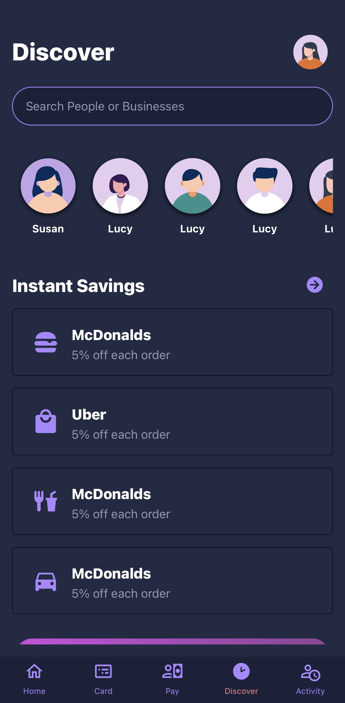

# plumm - A Digital Banking App

This repository provides a template/prototype for a digital banking app, inspired by apps like Chime and Cashapp. It's designed to be a starting point for developers working on similar projects with several screens and utilizes Expo and UI Kitten for the user interface.

## Preview

### Multiple Screens!!





## Key Features:
- Multiple screens implementing modern business logic.
- Account balances and transaction history display
- Change app theme seamlessly with UI Kitten.
- Modern and user-friendly UI built with UI Kitten
- Expo for quick cross-platform development

## Getting Started:

### Clone this repository:

```bash
git clone https://github.com/dkyazzentwatwa/plumm.git
```

Install dependencies:
```javascript
npm install
```
Use code with caution.

Run the app:
```javascript
npx expo start
```
### Development:

Feel free to modify and extend the codebase to fit your specific needs.

Refer to the Expo and UI Kitten documentation for further guidance:
Expo Documentation
UI Kitten Documentation

### Contributing:

I welcome contributions to this project! Please follow the contribution guidelines and submit pull requests for your changes.

Note: This is a basic template and functionalities mentioned are placeholders. You'll need to implement the logic and connect to appropriate APIs for each feature.

License:

This project is licensed under the MIT License (see LICENSE file for details).

Contact:

If you have any questions or suggestions, feel free to create an issue in this repository or email me at dkyazzentwatwa@gmail.com
